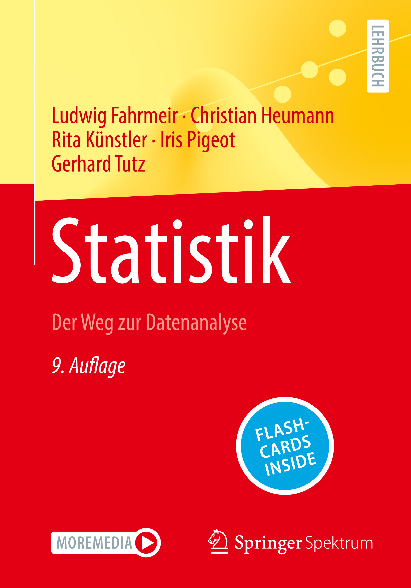

# Statistik-LB-FTPKH
Hier finden Sie die R Codes zum Lehrbuch [*Fahrmeir et al., Statistik, 9. Aufl.*](https://link.springer.com/book/10.1007/978-3-662-67526-7) (Springer Spektrum, 2023).

Hinweise zur Benutzung des R Pakets

Das Verzeichnis RCode enthält Funktionen zum Zeichnen vieler Grafiken und zur Berechnung einiger Beispiele. Sie können die "tar.gz" oder die "zip"-Datei herunterladen (wichtig: mit dem download button) und in R Studio installieren (aus lokaler Datei: Tools -> Install Packages -> dropdown Menü:install from: Package Archive File).

Die pdf-Datei enthält die Liste aller Grafiken und Beispiele mit Hinweisen, um welche Grafik oder um welches Beispiel es sich im Buch handelt (Hinweis: die Numerierung in R ist nicht unbedingt übereinstimmend mit der Numerierung der Grafiken und Beispiele im Buch).

Einzelne Grafiken können dann gezeichnet werden, z.B. 
abb2.4()
erzeugt Abbildung 2.4 im Buch (Diagramm der Nettomieten)

